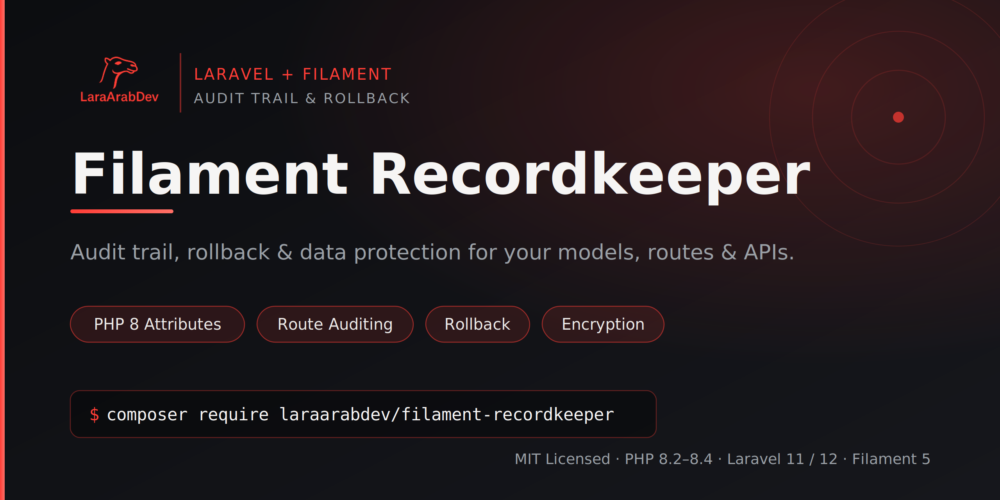

<p align="center">
  
</p>

<p align="center">
  <a href="https://github.com/LaraArabDev/filament-recordkeeper/actions/workflows/tests.yml"></a>
  <a href="https://github.com/LaraArabDev/filament-recordkeeper/actions/workflows/static-analysis.yml"></a>
  <a href="https://github.com/LaraArabDev/filament-recordkeeper/actions/workflows/code-style.yml"></a>
  <a href="https://github.com/LaraArabDev/filament-recordkeeper/actions/workflows/load-test.yml"></a>
  <a href="https://github.com/LaraArabDev/filament-recordkeeper/actions/workflows/mutation-testing.yml"></a>
  <a href="https://codecov.io/gh/LaraArabDev/filament-recordkeeper"></a>
  <a href="https://scorecard.dev/viewer/?uri=github.com/LaraArabDev/filament-recordkeeper"></a>
  <a href="LICENSE"></a>
</p>

<p align="center">
  Audit trail, rollback &amp; data protection for your models, routes &amp; APIs.<br>
  Built on <a href="https://laravel-auditing.com/">owen-it/laravel-auditing</a> · PHP 8.2–8.4 · Laravel 11 / 12 · Filament 5
</p>

---

```bash
composer require laraarabdev/filament-recordkeeper
php artisan recordkeeper:install
php artisan migrate
```

---

## What it tracks

laravel-auditing covers model changes. Recordkeeper extends that to everything your app does:

| Trigger | What is recorded |
|---|---|
| Model created / updated / deleted | Eloquent attribute diff |
| Route or API request | Guard, actor, method, duration, HTTP status |
| Queued job | Start time, pass / fail, duration |
| Artisan command | Exit code, peak memory, audit impact count, anomaly flag |
| Outbound HTTP call from a job | URL, status, duration — linked to the parent job audit |
| Rollback | Recorded as its own named audit event |

Everything lands in one `audits` table. **Filament 5 is optional** — the core runs fully headless.

---

## Installation

```bash
composer require laraarabdev/filament-recordkeeper
php artisan recordkeeper:install   # publishes config + migrations
php artisan migrate
```

Force-overwrite already-published files:

```bash
php artisan recordkeeper:install --force
```

### With Filament

```php
use LaraArabDev\Recordkeeper\Filament\RecordkeeperPlugin;

public function panel(Panel $panel): Panel
{
    return $panel->plugins([
        RecordkeeperPlugin::make()
            ->enableRollback()
            ->enableTimeline()
            ->enableStatsWidget()
            ->navigationGroup('Audit'),
    ]);
}
```

### Headless (no Filament)

```php
use LaraArabDev\Recordkeeper\Attributes\Auditable;
use LaraArabDev\Recordkeeper\Attributes\Redact;
use LaraArabDev\Recordkeeper\Concerns\AuditsChanges;

#[Auditable(events: ['created', 'updated', 'deleted'], retentionDays: 365)]
#[Redact('discount_code')]
class Order extends Model implements \OwenIt\Auditing\Contracts\Auditable
{
    use AuditsChanges;
}
```

---

## PHP 8 Attributes

| Attribute | Effect |
|---|---|
| `#[Auditable]` | Enable auditing — accepts `events`, `retentionDays`, `threshold`, `tags` |
| `#[AuditExclude('field')]` | Never write this field to any audit record |
| `#[Redact('field')]` | Replace value with `***` at write time |
| `#[Encrypt('field')]` | AES-encrypt in audit; auto-decrypted on rollback |
| `#[Audit('event.name')]` | Fire a custom named audit event |

```php
#[Auditable(events: ['created', 'updated', 'deleted'], tags: ['payments'])]
#[AuditExclude('internal_notes')]
#[Redact('cvv')]
#[Encrypt('national_id')]
class Payment extends Model implements \OwenIt\Auditing\Contracts\Auditable
{
    use AuditsChanges;
}
```

---

## Route Auditing

```php
// Web — stores guard = 'web', actor = auth()->user()
Route::middleware('audit')->post('/pay', PayController::class);

// API — stores guard = 'api', resolves actor from token
Route::middleware(['auth:sanctum', 'audit.api'])->apiResource('orders', OrderApiController::class);
```

---

## Job & Command Auditing

```php
// config/recordkeeper.php
'jobs'     => ['enabled' => true],
'commands' => [
    'enabled' => true,
    'metrics' => [
        'memory'      => true,
        'audit_count' => true,
        'anomaly'     => true,
    ],
],
```

Command audit context:

```json
{
  "command": "app:sync-orders",
  "exit_code": 0,
  "duration_ms": 842,
  "memory_peak_mb": 34.5,
  "audit_count": 217,
  "anomaly": true,
  "anomaly_reason": "audit_count 217 > 2x avg (98)"
}
```

---

## Outbound HTTP Tracking

```php
'http' => [
    'enabled'         => true,
    'capture_headers' => true,
    'capture_body'    => false,
    'exclude_hosts'   => ['internal.example.com'],
],
```

HTTP calls made inside a job are stored in `audit_http_requests` and linked to the parent job audit. Shown as a tab in the Filament detail page.

---

## Rollback

```php
// Preview before applying
$audit   = $order->audits()->rollbackable()->latest('id')->first();
$preview = $audit->rollback(dryRun: true);
$audit->rollback();

// Entire batch — atomic, in reverse order
Recordkeeper::rollbackBatch('nightly-import');

// By ID
Recordkeeper::rollback($auditId);
```

Handles encrypted fields, `SoftDeletes`, and sequential re-rollback automatically.

---

## Batch Auditing

```php
Recordkeeper::batch('nightly-import-2025-01', function () {
    Order::create([...]);
    Order::create([...]);
    // every audit shares batch_id = 'nightly-import-2025-01'
});

Recordkeeper::rollbackBatch('nightly-import-2025-01');
```

---

## Fluent Query Builder

```php
use LaraArabDev\Recordkeeper\Support\AuditQuery;

$audits = app(AuditQuery::class)
    ->model('Order')
    ->event(['created', 'updated'])
    ->actor(42, 'Admin')
    ->guard('api')
    ->tag('finance')
    ->since('-7 days')
    ->rollbackable()
    ->latest()
    ->limit(50)
    ->builder()
    ->get();
```

| Method | Description |
|---|---|
| `->model(string)` | Short name or FQCN |
| `->event(string\|array)` | Filter by event name(s) |
| `->actor(id, type?)` | `user_id` + optional `user_type` |
| `->guard(string)` | Auth guard |
| `->tag(string\|array)` | Tag(s) |
| `->batch(string)` | `batch_id` |
| `->between(from, until)` | Date range |
| `->since(from)` | Created after |
| `->rollbackable()` | Model-change events only |
| `->search(string)` | Full-text search |
| `->builder()` | Underlying Eloquent Builder |

---

## Model Scopes

```php
use LaraArabDev\Recordkeeper\Models\Audit;

Audit::forGuard('api')->get();
Audit::forModel('Order')->latest()->get();
Audit::forSubject($order)->get();
Audit::forActor($admin)->get();
Audit::forBatch('nightly-import')->get();
Audit::rollbackable()->latest('id')->get();
Audit::routeHits()->whereDate('created_at', today())->get();
```

---

## Manual Log

```php
Recordkeeper::log('payment.gateway.timeout', context: [
    'gateway' => 'stripe',
    'attempt' => 3,
]);

Recordkeeper::log('export.triggered', subject: $order, context: ['format' => 'csv']);
```

---

## Filament — Audit History on Any Resource

```php
use LaraArabDev\Recordkeeper\Filament\Concerns\HasAuditHistory;

class OrderResource extends Resource
{
    use HasAuditHistory;
}
```

Or add the relation manager manually:

```php
use LaraArabDev\Recordkeeper\Filament\RelationManagers\AuditsRelationManager;

public static function getRelationManagers(): array
{
    return [AuditsRelationManager::class];
}
```

---

## CLI Reference

```bash
php artisan recordkeeper:install                                   # publish config + migrations
php artisan recordkeeper:search --model=Order --event=updated --since="-7 days" --json
php artisan recordkeeper:show 1842                                 # diff + context for one audit
php artisan recordkeeper:rollback 1842 --dry-run                  # preview
php artisan recordkeeper:rollback 1842 --yes                      # apply
php artisan recordkeeper:rollback --batch=nightly-import          # entire batch
php artisan recordkeeper:tail --model=Order --interval=3          # live follow
php artisan recordkeeper:stats --since="-30 days"                 # stats dashboard
php artisan recordkeeper:prune --days=365 --dry-run               # preview prune
php artisan recordkeeper:prune --days=365 --yes                   # apply prune
php artisan recordkeeper:models                                    # list auditable models
```

---

## Configuration

| Key | Default | Description |
|---|---|---|
| `enabled` | `true` | Global kill switch |
| `privacy.mode` | `redact` | `redact` \| `encrypt` \| `off` |
| `privacy.mask` | `***` | Redaction replacement |
| `privacy.sensitive_patterns` | `[password, secret, token …]` | Auto-redacted field name patterns |
| `rollback.enabled` | `true` | Enable rollback |
| `rollback.restore_deleted` | `true` | Restore soft-deleted records |
| `retention.default_days` | `0` | Prune after N days (`0` = keep forever) |
| `queue.enabled` | `false` | Queue audit writes |
| `jobs.enabled` | `false` | Track queued jobs |
| `commands.enabled` | `false` | Track Artisan commands |
| `commands.metrics.memory` | `true` | Peak memory per command |
| `commands.metrics.audit_count` | `true` | Model changes per command |
| `commands.metrics.anomaly` | `false` | Flag abnormal runs |
| `http.enabled` | `false` | Track outbound HTTP from jobs |
| `http.capture_headers` | `false` | Store request/response headers |
| `http.capture_body` | `false` | Store response body |
| `http.exclude_hosts` | `[]` | Skip hosts |
| `strict` | `false` | Throw on write failure (use in tests) |

---

## Database Schema

**`audits`** (extends laravel-auditing base table):

| Column | Type | Purpose |
|---|---|---|
| `guard` | `varchar` indexed | Auth guard — dedicated column for fast filtering |
| `batch_id` | `varchar` indexed | Groups related audits |
| `context` | `json` | Route info, duration, command metrics, custom keys |

**`audit_http_requests`**:

| Column | Type | Purpose |
|---|---|---|
| `audit_id` | `bigint` nullable | Links to parent job audit |
| `method` | `varchar(10)` | HTTP verb |
| `url` | `text` | Request URL |
| `status_code` | `int` nullable | Response status |
| `duration_ms` | `int` nullable | Round-trip time |
| `failed` | `boolean` | `true` if connection failed |
| `request_headers` | `json` nullable | Captured when `capture_headers = true` |
| `response_headers` | `json` nullable | Captured when `capture_headers = true` |
| `response_body` | `text` nullable | Captured when `capture_body = true` |

---

## Benchmarks

```bash
composer bench          # full suite
composer bench:quick    # fast smoke-run (3 revs × 2 iterations)
composer bench:http     # HttpTracker + HTTP listener
composer bench:command  # command metrics
```

PHP 8.3 · SQLite in-memory · no opcache:

| Operation | Mean |
|---|---|
| `HttpTracker` set + clear context | ~0.03 µs |
| `HttpTracker` start + finish one request | ~0.11 µs |
| `AttributeResolver::resolve` (cached) | ~0.05 µs |
| `AttributeResolver::resolve` (cold, `#[Redact]`) | ~4.4 µs |
| Write one `Audit` row | ~76 µs |
| Write one `AuditHttpRequest` row | ~62 µs |
| HTTP listener disabled (zero-cost) | ~10 µs |
| HTTP listener enabled, sync write | ~96 µs |
| Command audit with anomaly detection | ~402 µs |

**All features are zero-cost when disabled** — listeners are not registered if the flag is off.

---

## Testing

```bash
composer test           # pest
composer test:coverage  # pest --coverage
composer analyse        # phpstan
composer format         # pint
```

| PHP | Laravel | Filament |
|---|---|---|
| 8.2 | 11 · 12 | ^5.0 |
| 8.3 | 11 · 12 | ^5.0 |
| 8.4 | 11 · 12 | ^5.0 |

---

## License

MIT — see [LICENSE](LICENSE).
# recordkeeper
