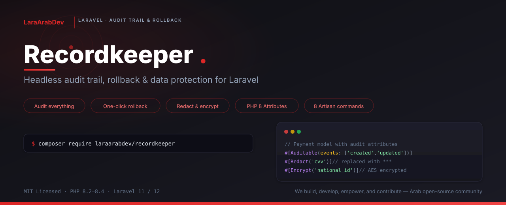
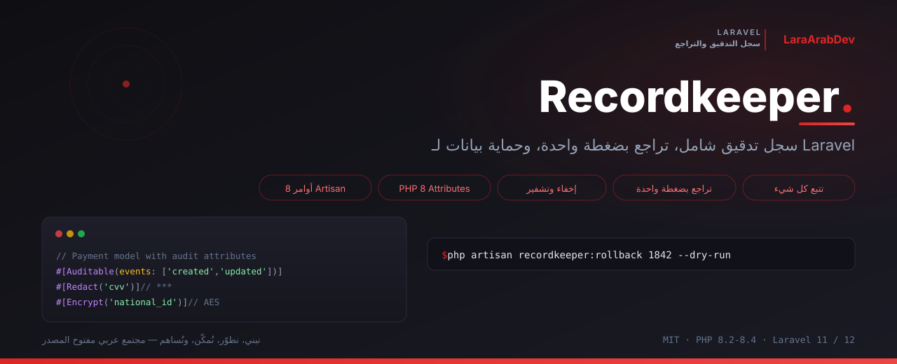

<p align="center">
    
</p>

<h1 align="center">Recordkeeper</h1>

<p align="center">
    <strong>Headless audit trail, rollback & data protection for Laravel</strong>
</p>

<p align="center">
    <a href="https://packagist.org/packages/laraarabdev/recordkeeper"></a>
    <a href="https://packagist.org/packages/laraarabdev/recordkeeper"></a>
    <a href="https://packagist.org/packages/laraarabdev/recordkeeper"></a>
    <a href="https://packagist.org/packages/laraarabdev/recordkeeper"></a>
    <a href="https://laravel.com"></a>
</p>

<p align="center">
    <a href="https://github.com/LaraArabDev/recordkeeper/actions/workflows/tests.yml"></a>
    <a href="https://codecov.io/gh/LaraArabDev/recordkeeper"></a>
    <a href="https://github.com/LaraArabDev/recordkeeper/actions/workflows/static-analysis.yml"></a>
    <a href="https://github.com/LaraArabDev/recordkeeper/actions/workflows/security.yml"></a>
    <a href="https://github.com/LaraArabDev/recordkeeper/actions/workflows/mutation-testing.yml"></a>
    <a href="https://github.com/LaraArabDev/recordkeeper/actions/workflows/code-style.yml"></a>
</p>

<p align="center">
    Track every model change, route hit, queued job, Artisan command, and application event — with one-click rollback, privacy controls, and zero config arrays.<br>
    Built on <a href="https://laravel-auditing.com/">owen-it/laravel-auditing</a> · PHP 8.2 – 8.4 · Laravel 11 / 12
</p>

<p align="center">
    <b><a href="https://github.com/LaraArabDev">LaraArabDev</a></b> — We build, develop, empower, and contribute. An Arab open-source community crafting production-grade Laravel packages.<br>
    <b><a href="https://github.com/LaraArabDev">LaraArabDev</a></b> — نبني، نطوّر، نُمكّن، ونُساهم. مجتمع عربي مفتوح المصدر يصنع حزم Laravel احترافية وجاهزة للإنتاج.
</p>

<p align="center">
    <a href="#-quick-start">Quick Start</a> ·
    <a href="#-php-8-attributes">Attributes</a> ·
    <a href="#-rollback">Rollback</a> ·
    <a href="#-artisan-commands">Commands</a> ·
    <a href="#-العربية">العربية</a>
</p>

---

## What is Recordkeeper?

Recordkeeper is a **Laravel package** that gives your application a complete audit trail — tracking **who** did **what**, **when**, and the ability to **undo it**. It goes far beyond simple model change tracking:

- **Model auditing** — every create, update, delete, and restore is logged automatically with before/after values
- **Route & API auditing** — log every HTTP request with actor, guard, IP, timing, and status code
- **Job lifecycle tracking** — follow queued jobs from dispatch through processing to completion or failure
- **Artisan command auditing** — track command execution with duration, memory usage, and anomaly detection
- **Application event auditing** — capture custom events with full payload
- **Outbound HTTP tracking** — record every external API call your jobs make
- **Privacy protection** — auto-redact sensitive fields (passwords, tokens, SSNs) and AES-encrypt recoverable fields
- **One-click rollback** — revert any change (single or batch) with dry-run preview
- **8 Artisan commands** — search, show, tail, stats, rollback, prune, export, and model discovery from the CLI
- **4 storage drivers** — database, Redis, log, or null for testing

All configured through clean **PHP 8 Attributes** — no config arrays to maintain.

> **Built on top of [owen-it/laravel-auditing](https://laravel-auditing.com/)** — the most popular audit package in the Laravel ecosystem. Recordkeeper installs it automatically as a dependency. If you already use `laravel-auditing`, Recordkeeper is a drop-in enhancement — your existing auditable models keep working.

---

## Why Recordkeeper over plain laravel-auditing?

| Feature | laravel-auditing alone | + Recordkeeper |
| --- | --- | --- |
| Model CRUD tracking | Yes | Yes |
| Route & API auditing | No | **Built-in middleware** |
| Job lifecycle tracking | No | **queued → processing → done/failed** |
| Artisan command auditing | No | **With anomaly detection** |
| Event auditing | No | **Opt-in with payload capture** |
| Outbound HTTP tracking | No | **Linked to parent job** |
| Configuration | PHP config arrays | **PHP 8 Attributes** |
| Privacy protection | Manual exclusions | **Auto-redact + AES encrypt** |
| Rollback | `transitionTo()` manual | **One-click + batch + dry-run** |
| CLI tools | No | **8 Artisan commands** |
| Storage backends | Database only | **4 drivers** |

---

## 🚀 Quick Start

### Install

```bash
composer require laraarabdev/recordkeeper
php artisan recordkeeper:install
php artisan migrate
```

### Add the trait — done

```php
class Order extends Model implements \OwenIt\Auditing\Contracts\Auditable
{
    use AuditsChanges;  // tracks creates, updates, deletes automatically
}
```

### Audit API routes

```php
Route::middleware('audit.api')->apiResource('orders', OrderController::class);
```

### Protect sensitive data

```php
#[Redact('cvv')]              // stored as ***
#[Encrypt('national_id')]     // AES-encrypted, recoverable on rollback
class Payment extends Model { ... }
```

### Undo a mistake

```php
Recordkeeper::rollback($auditId);
```

**No boilerplate. No custom middleware.** Just attributes, traits, and you're auditing.

---

## 📄 Default Configuration

After running `php artisan recordkeeper:install`, a `config/recordkeeper.php` file is published. Here are the **defaults out of the box** — everything works with zero changes:

| Setting | Default | What it means |
| --- | --- | --- |
| `enabled` | `true` | Auditing is active |
| `events` | `['created', 'updated', 'deleted', 'restored']` | All CRUD events tracked |
| `driver` | `'database'` | Audits stored in `audits` table |
| `privacy.mode` | `'redact'` | Sensitive fields auto-redacted with `***` |
| `privacy.global_exclude` | `['password', 'remember_token']` | Never stored in any audit |
| `rollback.enabled` | `true` | Rollback feature active |
| `queue.enabled` | `false` | Sync writes (enable for async) |
| `jobs.enabled` | `false` | Opt-in per job or enable globally |
| `commands.enabled` | `false` | Opt-in per command or enable globally |
| `routes.enabled` | `false` | Global route auditing (all web/api routes) |
| `http.enabled` | `false` | Outbound HTTP tracking off by default |
| `retention.default_days` | `0` | Keep audits forever (set a number to auto-prune) |
| `strict` | `false` | Failed writes log silently (enable in tests to throw) |

### Full config file

<details>
<summary><strong>config/recordkeeper.php</strong></summary>

```php
<?php

declare(strict_types=1);

return [
    'enabled' => env('RECORDKEEPER_ENABLED', true),

    'events' => ['created', 'updated', 'deleted', 'restored'],

    'privacy' => [
        'mode' => env('RECORDKEEPER_PRIVACY', 'redact'), // redact|encrypt|off
        'mask' => '***',
        'sensitive_patterns' => [
            'password', 'secret', 'token', 'api_key',
            'authorization', 'card', 'cvv', 'ssn', 'iban',
        ],
        'global_exclude' => ['password', 'remember_token'],
    ],

    'rollback' => [
        'enabled' => true,
        'permission' => 'rollback_audits',
        'restore_deleted' => true,
        'track' => env('RECORDKEEPER_ROLLBACK_TRACK', true),
    ],

    'retention' => [
        'default_days' => (int) env('RECORDKEEPER_RETENTION_DAYS', 0), // 0 = keep forever
        'per_model' => [],
    ],

    'guards' => [
        'web' => true,
        'api' => true,
    ],

    'routes' => [
        'enabled' => env('RECORDKEEPER_ROUTES', false),
        'web'     => true,
        'api'     => true,
        'exclude' => [
            'horizon/*', 'telescope/*', '_debugbar/*',
            '_ignition/*', 'sanctum/*', 'livewire/*', 'health',
        ],
        'body'   => false,
        'sample' => 1.0,
        'tag'    => null,
    ],

    'discovery' => [
        'paths' => ['app/Models'],
    ],

    'strict' => env('RECORDKEEPER_STRICT', false),

    'driver' => env('RECORDKEEPER_DRIVER', 'database'),

    'drivers' => [
        'database' => [
            'chunk_size' => (int) env('RECORDKEEPER_CHUNK_SIZE', 500),
        ],
        'redis' => [
            'connection' => env('RECORDKEEPER_REDIS_CONNECTION', 'default'),
            'ttl' => (int) env('RECORDKEEPER_REDIS_TTL', 0),
        ],
        'log' => [
            'channel' => env('RECORDKEEPER_LOG_CHANNEL', 'stack'),
            'level' => env('RECORDKEEPER_LOG_LEVEL', 'info'),
        ],
        'null' => [],
    ],

    'cache' => [
        'enabled' => env('RECORDKEEPER_CACHE', false),
        'store' => env('RECORDKEEPER_CACHE_STORE', null),
        'ttl' => (int) env('RECORDKEEPER_CACHE_TTL', 300),
    ],

    'pipeline' => [],

    'queue' => [
        'enabled' => env('RECORDKEEPER_QUEUE', false),
        'connection' => env('RECORDKEEPER_QUEUE_CONNECTION', null),
        'queue' => env('RECORDKEEPER_QUEUE_NAME', 'audits'),
    ],

    'jobs' => [
        'enabled' => env('RECORDKEEPER_JOBS', false),
        'exclude' => [],
    ],

    'commands' => [
        'enabled' => env('RECORDKEEPER_COMMANDS', false),
        'exclude' => [
            'schedule:run', 'schedule:finish',
            'queue:work', 'queue:listen',
            'horizon:work', 'horizon:supervisor',
            'recordkeeper:tail',
        ],
        'metrics' => [
            'memory' => true,
            'audit_count' => true,
            'anomaly' => env('RECORDKEEPER_ANOMALY', false),
            'anomaly_multiplier' => 2.0,
            'anomaly_min_runs' => 5,
        ],
    ],

    'http' => [
        'enabled' => env('RECORDKEEPER_HTTP', false),
        'mode' => env('RECORDKEEPER_HTTP_MODE', 'auto'),
        'queue' => env('RECORDKEEPER_HTTP_QUEUE', false),
        'queue_name' => env('RECORDKEEPER_HTTP_QUEUE_NAME', null),
        'capture_headers' => env('RECORDKEEPER_HTTP_HEADERS', false),
        'capture_body' => env('RECORDKEEPER_HTTP_BODY', false),
        'body_limit' => 1000,
        'exclude_hosts' => [],
    ],

    'events_tracking' => [
        'enabled' => env('RECORDKEEPER_EVENTS', false),
        'exclude' => [],
    ],

    'listen' => [
        // \App\Events\UserRegistered::class,
    ],
];
```

</details>

### What works immediately after install

With the default config, **model auditing is fully active** the moment you add the `AuditsChanges` trait:

- All `created`, `updated`, `deleted`, `restored` events are tracked
- Fields are auto-discovered from `$fillable` and `$casts`
- `password` and `remember_token` are globally excluded
- Fields matching `password`, `secret`, `token`, `api_key`, `card`, `cvv`, `ssn`, `iban` are auto-redacted with `***`
- Audits are stored in the `audits` database table with no expiry
- Rollback is enabled and ready to use

Everything else (jobs, commands, events, HTTP tracking, queue writes) is **opt-in** — enable when you need it.

---

## 📦 Prerequisites

| Requirement | Version |
| --- | --- |
| PHP | 8.2, 8.3, or 8.4 |
| Laravel | 11 or 12 |
| owen-it/laravel-auditing | ^13.0 or ^14.0 (auto-installed) |

> **Already using laravel-auditing?** Recordkeeper is a drop-in enhancement. Your existing auditable models keep working — add `AuditsChanges` to unlock the extra features.

---

## 🏷️ PHP 8 Attributes

### Model Attributes

| Attribute | Description |
| --- | --- |
| `#[Auditable]` | Enable auditing: `events`, `only`, `exclude`, `redact`, `encrypt`, `retentionDays`, `threshold`, `tags` |
| `#[AuditExclude('field')]` | Never store this field (repeatable) |
| `#[Redact('field')]` | Replace with `***` before storage (repeatable) |
| `#[Encrypt('field')]` | AES-encrypt, auto-decrypt on rollback (repeatable) |

### Non-Model Attributes

| Attribute | Target | Description |
| --- | --- | --- |
| `#[Audit]` | Controller method | Route auditing: `tag`, `body`, `response`, `sample` |
| `#[AuditJob]` | Job class | Job lifecycle: `queued`, `processing`, `processed`, `failed`, `tags` |
| `#[AuditCommand]` | Command class | Command tracking: `tags` |
| `#[AuditEvent]` | Event class | Event tracking: `tags`, `capturePayload` |

### Traits (for method-based overrides)

| Trait | Overridable Methods |
| --- | --- |
| `AuditsJob` | `auditJobTags()`, `shouldAuditQueued()`, `shouldAuditProcessing()`, `shouldAuditProcessed()`, `shouldAuditFailed()` |
| `AuditsCommand` | `auditCommandTags()` |
| `AuditsEvent` | `auditEventTags()`, `shouldCapturePayload()` |

> **Priority:** Attribute > Trait > Config. When both are present, the attribute wins.

### Full Model Example

```php
#[Auditable(
    events: ['created', 'updated', 'deleted'],
    tags: ['payments'],
    retentionDays: 180,
    threshold: 500,
)]
#[AuditExclude('internal_notes')]
#[Redact('cvv')]
#[Encrypt('national_id')]
class Payment extends Model implements \OwenIt\Auditing\Contracts\Auditable
{
    use AuditsChanges;
}
```

---

## ⚙️ Config Defaults & Overrides

```
config/recordkeeper.php   →  Global defaults (all models)
       ↓
#[Auditable(...)]         →  Per-model overrides
       ↓
Auto-detection            →  Fields from $fillable + $casts
       ↓
Auto-redaction            →  Pattern matching on field names
```

With **just the trait** (no attribute), Recordkeeper automatically:

1. Tracks `created`, `updated`, `deleted`, `restored`
2. Discovers fields from `$fillable` and `$casts`
3. Excludes `password` and `remember_token`
4. Auto-redacts fields matching `password`, `secret`, `token`, `api_key`, `card`, `cvv`, `ssn`, `iban`
5. Uses global retention policy

Override per model only when needed:

```php
#[Auditable(
    events: ['updated', 'deleted'],
    retentionDays: 90,
    tags: ['finance'],
)]
class Invoice extends Model implements \OwenIt\Auditing\Contracts\Auditable
{
    use AuditsChanges;
}
```

---

## 🌐 Incoming Request Auditing (Route & API)

Track every HTTP request coming **into** your application — who hit which endpoint, when, and what happened.

### What gets recorded

| Field | Description |
| --- | --- |
| Route name / path | e.g. `orders.store` or `/api/orders` |
| HTTP method | `GET`, `POST`, `PUT`, `DELETE`, etc. |
| Status code | `200`, `404`, `500`, etc. |
| Duration | Response time in milliseconds |
| Actor | Authenticated user (resolved via guard) |
| IP address | Client IP |
| User agent | Browser / client identifier |
| Request body | Optional — disabled by default |

Audits are stored in the `audits` table with `auditable_type = 'route'` and events like `route.get`, `route.post`, etc.

### Setup — per-route middleware

Two middleware aliases are registered automatically:

| Middleware | Guard | Actor Resolution |
| --- | --- | --- |
| `audit` | `web` | `auth()->user()` |
| `audit.api` | `api` | Iterates all non-web guards (Sanctum, Passport, etc.) |

```php
// Web routes
Route::middleware('audit')->group(function () {
    Route::post('/pay', PayController::class);
});

// API routes
Route::middleware(['auth:sanctum', 'audit.api'])->group(function () {
    Route::apiResource('orders', OrderApiController::class);
});
```

### Setup — global (audit every route)

Audit **every** web and API route with one env var — no middleware changes needed:

```env
RECORDKEEPER_ROUTES=true
```

This pushes audit middleware into the `web` and `api` middleware groups automatically. Routes that already have explicit `audit` or `audit.api` middleware are **never double-audited**.

Configure via `config/recordkeeper.php`:

```php
'routes' => [
    'enabled' => env('RECORDKEEPER_ROUTES', false),
    'web'     => true,       // audit web routes
    'api'     => true,       // audit api routes
    'exclude' => [           // skip these paths
        'horizon/*', 'telescope/*', '_debugbar/*',
        '_ignition/*', 'sanctum/*', 'livewire/*', 'health',
    ],
    'body'   => false,       // capture request body
    'sample' => 1.0,         // 1.0 = 100%, 0.1 = 10%
    'tag'    => null,         // optional tag for all global audits
],
```

### Fine-grained control

```php
#[Audit(tag: 'checkout', body: true, response: true, sample: 0.5)]
public function store(Request $request) { ... }
```

### Incoming webhooks

Incoming webhooks (e.g. from Stripe, GitHub, Twilio) are just regular HTTP requests hitting your routes. They are audited the same way:

- **Per-route:** add `audit.api` middleware to your webhook route
- **Global:** enable `RECORDKEEPER_ROUTES=true` — webhooks in `web`/`api` groups are tracked automatically

No special setup required.

---

## 📡 Outbound HTTP Tracking

Track every HTTP request your application makes **to external services** — API calls to Stripe, payment gateways, third-party services, outgoing webhooks, etc.

### What gets recorded

| Field | Description |
| --- | --- |
| URL | Full request URL |
| Host | Extracted hostname (e.g. `api.stripe.com`) |
| HTTP method | `GET`, `POST`, `PUT`, `DELETE`, etc. |
| Status code | Response status (`200`, `500`, `null` on connection failure) |
| Duration | Round-trip time in milliseconds |
| Failed | Whether the connection failed entirely |
| Request headers | Optional — disabled by default |
| Response headers | Optional — disabled by default |
| Response body | Optional — disabled by default, truncated to `body_limit` |

Outbound requests are stored in a separate `audit_http_requests` table, linked to a parent audit record via `audit_id`.

### Setup

```env
RECORDKEEPER_HTTP=true
```

That's it. Recordkeeper hooks into Laravel's built-in HTTP client events (`RequestSending`, `ResponseReceived`, `ConnectionFailed`) — no middleware or code changes needed.

> **Important:** Only requests made through Laravel's `Http::` facade (Illuminate HTTP client) are tracked. Raw cURL or direct Guzzle calls bypass Laravel's events and are **not** captured.

### Configuration

```php
'http' => [
    'enabled' => env('RECORDKEEPER_HTTP', false),
    'mode' => env('RECORDKEEPER_HTTP_MODE', 'auto'), // 'auto' = all, 'manual' = opt-in only
    'queue' => env('RECORDKEEPER_HTTP_QUEUE', false), // async persistence
    'queue_name' => env('RECORDKEEPER_HTTP_QUEUE_NAME', null),
    'capture_headers' => env('RECORDKEEPER_HTTP_HEADERS', false),
    'capture_body' => env('RECORDKEEPER_HTTP_BODY', false),
    'body_limit' => 1000,         // truncate response body at N characters
    'exclude_hosts' => [],        // skip these hosts entirely
],
```

### Modes

| Mode | Behavior |
| --- | --- |
| `auto` (default) | All outbound HTTP calls are tracked automatically |
| `manual` | Only track calls made during jobs/contexts that explicitly opt in (via attribute or trait) |

### Excluding hosts

Skip noisy or internal services:

```php
'exclude_hosts' => ['localhost', 'internal-service.local'],
```

### Outgoing webhooks

If your app sends webhooks to external services using Laravel's `Http::` client, they are tracked automatically when `http.enabled` is true — no special setup.

```php
// This is tracked automatically
Http::post('https://partner-api.com/webhook', $payload);
```

---

## 🔄 Incoming vs Outbound — at a glance

| | Incoming (Route) | Outbound (HTTP) |
| --- | --- | --- |
| **Direction** | External → your app | Your app → external |
| **What** | Someone hits your endpoints | Your app calls external APIs |
| **Mechanism** | Middleware on routes | Laravel HTTP client event listener |
| **Table** | `audits` | `audit_http_requests` |
| **Enable** | `audit` middleware or `RECORDKEEPER_ROUTES=true` | `RECORDKEEPER_HTTP=true` |
| **Webhooks** | Incoming webhooks = regular route hits | Outgoing webhooks via `Http::` = tracked |
| **Code changes** | None (global) or add middleware (per-route) | None — automatic via events |

---

## 🔧 Job, Command & Event Auditing

Three ways to opt in — use whichever fits:

| Method | How | Best for |
| --- | --- | --- |
| **Trait** | `use AuditsJob;` | Quick opt-in, override methods |
| **Attribute** | `#[AuditJob]` | Declarative, all config in one place |
| **Config** | `jobs.enabled = true` | Audit everything globally |

### Jobs

```php
use LaraArabDev\Recordkeeper\Concerns\AuditsJob;

class ProcessPayment implements ShouldQueue
{
    use AuditsJob;
    // Tracks: queued → processing → processed/failed
}
```

### Commands

```php
#[AuditCommand(tags: ['maintenance'])]
class PruneInactiveUsers extends Command { ... }
```

Includes **anomaly detection** — flags runs where duration or audit count exceeds the historical average.

### Events

```php
#[AuditEvent(capturePayload: true, tags: ['shipping'])]
class OrderShipped { ... }
```

---

## 🔒 Privacy & Data Protection

Sensitive data is **transformed before it reaches the audit store** — never plaintext.

| Method | How | Recoverable? |
| --- | --- | --- |
| `#[Redact('field')]` | Replaced with `***` | No |
| `#[Encrypt('field')]` | AES-encrypted | Yes — auto-decrypted on rollback |
| Auto-redaction | Pattern-matched fields | No |

**Auto-redacted patterns:** `password` · `secret` · `token` · `api_key` · `authorization` · `card` · `cvv` · `ssn` · `iban`

```php
#[Redact('ssn', 'date_of_birth')]
#[Encrypt('api_secret')]
class Patient extends Model { ... }
```

---

## ⏪ Rollback

Undo any audited change — single or batch, with dry-run preview.

```php
// Preview first
$preview = Recordkeeper::rollback($auditId, dryRun: true);

// Apply
Recordkeeper::rollback($auditId);

// Batch rollback — atomic, in reverse order
Recordkeeper::rollbackBatch('nightly-import');
```

| Original Event | Rollback Action |
| --- | --- |
| `created` | Model is force-deleted |
| `updated` | Old values restored |
| `deleted` | Model restored (supports SoftDeletes) |

> Encrypted values are auto-decrypted before restoration. Auditing is disabled during rollback.

### Via Artisan

```bash
php artisan recordkeeper:rollback 1842 --dry-run   # preview
php artisan recordkeeper:rollback 1842 --yes        # apply
php artisan recordkeeper:rollback --batch=nightly    # batch
```

---

## 📦 Batch Auditing

Group related changes for atomic rollback:

```php
Recordkeeper::batch('nightly-import-2025-01', function () {
    $order1 = Order::create([...]);
    $order2 = Order::create([...]);
    $inventory->decrement('stock', 50);
    // All 3 audits share the same batch_id
});

// Roll back the entire import:
Recordkeeper::rollbackBatch('nightly-import-2025-01');
```

---

## 📝 Manual Logging

Record custom events outside the Eloquent/middleware flow:

```php
Recordkeeper::log('payment.gateway.timeout', context: [
    'gateway' => 'stripe',
    'attempt' => 3,
]);

Recordkeeper::log('export.triggered', subject: $order, context: [
    'format' => 'csv',
    'rows'   => 1500,
]);
```

---

## 🔍 Querying Audits

### Eloquent Scopes

```php
Audit::forModel('Order')->latest()->get();
Audit::forSubject($order)->get();
Audit::forActor($admin)->get();
Audit::forGuard('api')->get();
Audit::forBatch('nightly-import')->get();
Audit::rollbackable()->get();
Audit::routeHits()->whereDate('created_at', today())->get();
Audit::jobAudits()->latest()->get();
```

### Fluent Query Builder

```php
$audits = app(AuditQuery::class)
    ->model('Order')
    ->event(['created', 'updated'])
    ->actor(42, 'Admin')
    ->guard('api')
    ->tag('finance')
    ->since('-7 days')
    ->rollbackable()
    ->latest()
    ->limit(50)
    ->builder()
    ->get();
```

<details>
<summary><strong>All query methods</strong></summary>

| Method | Description |
| --- | --- |
| `->model(string)` | Filter by model (short name or FQCN) |
| `->subjectId(int\|string)` | Filter by auditable ID |
| `->event(string\|array)` | Filter by event name(s) |
| `->actor(id, type?)` | Filter by user_id + optional user_type |
| `->actorType(string)` | Filter by actor type only |
| `->onlyAuthenticated()` | Exclude system/anonymous audits |
| `->guard(string)` | Filter by auth guard |
| `->tag(string\|array)` | Filter by tag(s) |
| `->batch(string)` | Filter by batch_id |
| `->between(from, until)` | Date range filter |
| `->since(from)` | Created after a date |
| `->search(string)` | Free-text search |
| `->rollbackable()` | Only model-change events |
| `->jobs()` | Only job lifecycle events |
| `->commands()` | Only command events |
| `->events()` | Only application events |
| `->latest()` | Order by newest first |
| `->limit(int)` | Limit results |
| `->offset(int)` | Offset for pagination |
| `->builder()` | Get the Eloquent Builder |

</details>

---

## 🖥️ Artisan Commands

| Command | Description |
| --- | --- |
| `recordkeeper:install` | Publish config and migrations |
| `recordkeeper:search` | Search audits with rich filters |
| `recordkeeper:show {id}` | Display audit with color-coded diff |
| `recordkeeper:tail` | Live-follow audits in real time |
| `recordkeeper:stats` | Statistics dashboard |
| `recordkeeper:models` | List auditable models with config |
| `recordkeeper:prune` | Delete old records by retention policy |
| `recordkeeper:rollback` | Revert single audit or batch |

```bash
php artisan recordkeeper:search --model=Order --event=updated --since="-7 days"
php artisan recordkeeper:show 1842
php artisan recordkeeper:tail --model=Order --guard=api
php artisan recordkeeper:stats --since="-30 days"
php artisan recordkeeper:prune --days=365 --dry-run
php artisan recordkeeper:rollback 1842 --dry-run
php artisan recordkeeper:rollback --batch=nightly-import --yes
php artisan recordkeeper:models --json
```

---

## 💾 Storage Drivers

| Driver | Best For | Rollback | Queries |
| --- | --- | --- | --- |
| **database** | Full-featured (default) | Yes | Yes |
| **redis** | High-throughput writes | No | Limited |
| **log** | Observability / debugging | No | No |
| **null** | Tests / disabled environments | No | No |

```php
// config/recordkeeper.php
'driver' => env('RECORDKEEPER_DRIVER', 'database'),
```

> **Custom drivers:** Implement `AuditDriver` and register via `AuditDriverManager::extend()`.

---

## 🛠️ Customization

### Custom Actor Resolver

```php
Recordkeeper::resolveActorUsing(function () {
    return auth()->guard('admin')->user()
        ?? auth()->guard('api')->user()
        ?? auth()->user();
});
```

### Context Enrichment

```php
Recordkeeper::pushContext([
    'deployment' => config('app.version'),
    'server'     => gethostname(),
]);

$order->auditContext(['reason' => 'Customer requested change']);
$order->update(['status' => 'refunded']);
```

### Tags

```php
#[Auditable(tags: ['billing', 'critical'])]
class Invoice extends Model { ... }

// Runtime
Recordkeeper::withTags(['nightly-sync']);
```

### React to Audit Writes

```php
use LaraArabDev\Recordkeeper\Events\ChangeRecorded;

class NotifyOnCriticalChange
{
    public function handle(ChangeRecorded $event): void
    {
        if (str_contains($event->audit->tags, 'critical')) {
            // Send Slack alert, create ticket, etc.
        }
    }
}
```

---

## 🗄️ Database Schema

### `audits` table (added columns)

| Column | Type | Index | Purpose |
| --- | --- | --- | --- |
| `guard` | `varchar` | Yes | Authentication guard |
| `batch_id` | `varchar` | Yes | Groups audits for batch rollback |
| `context` | `json` | — | Route info, duration, metrics |

### `audit_http_requests` table

| Column | Type | Purpose |
| --- | --- | --- |
| `audit_id` | `bigint` FK | Links to parent job audit |
| `method` | `varchar(10)` | HTTP verb |
| `url` | `text` | Full request URL |
| `status_code` | `int` | Response status |
| `duration_ms` | `int` | Round-trip time |
| `failed` | `boolean` | Connection failed? |

---

## ⚡ Performance

| Operation | Overhead |
| --- | --- |
| Model audit (sync) | ~1-2ms |
| Model audit (async) | < 0.5ms |
| Route middleware | ~1-2ms |
| Job/Command/Event | ~0.5-1ms |
| HTTP tracking | ~0.3ms |

**Why it's fast:** opt-in architecture (zero overhead for disabled features), early exits everywhere, no reflection in hot paths, lightweight DTOs, and sampling support.

### Production Tips

| Scenario | Recommendation |
| --- | --- |
| High-traffic API (1000+ req/s) | Enable `queue.enabled`, use `sample: 0.1` |
| Write-heavy app | Use `redis` driver |
| Testing | Use `null` driver |
| Large audit tables | Set `retention.default_days`, schedule `recordkeeper:prune` daily |

```bash
# Run benchmarks
composer bench           # full suite
composer bench:quick     # fast run
```

---

## 📋 Configuration Reference

<details>
<summary><strong>Full configuration table</strong></summary>

| Key | Default | Description |
| --- | --- | --- |
| **General** | | |
| `enabled` | `true` | Global on/off switch |
| `events` | `['created','updated','deleted','restored']` | Default events |
| `strict` | `false` | Throw on failure |
| `driver` | `'database'` | Storage backend |
| **Privacy** | | |
| `privacy.mode` | `'redact'` | `redact` / `encrypt` / `off` |
| `privacy.mask` | `'***'` | Redaction string |
| `privacy.sensitive_patterns` | `['password','secret',...]` | Auto-redacted patterns |
| `privacy.global_exclude` | `['remember_token']` | Always excluded fields |
| **Rollback** | | |
| `rollback.enabled` | `true` | Enable rollback |
| `rollback.permission` | `'rollback_audits'` | Required permission |
| **Retention** | | |
| `retention.default_days` | `0` | Prune after N days (0 = forever) |
| `retention.per_model` | `[]` | Per-model overrides |
| **Routes (incoming)** | | |
| `routes.enabled` | `false` | Global route auditing |
| `routes.web` | `true` | Audit web routes |
| `routes.api` | `true` | Audit API routes |
| `routes.exclude` | `['horizon/*',...]` | Paths to skip |
| `routes.body` | `false` | Capture request body |
| `routes.sample` | `1.0` | Sampling rate (0.0–1.0) |
| `routes.tag` | `null` | Tag for global audits |
| **Queue** | | |
| `queue.enabled` | `false` | Async audit writes |
| `queue.connection` | `null` | Queue connection |
| `queue.queue` | `'audits'` | Queue name |
| **Jobs** | | |
| `jobs.enabled` | `false` | Track job lifecycle |
| `jobs.exclude` | `[]` | Jobs to skip |
| **Commands** | | |
| `commands.enabled` | `false` | Track commands |
| `commands.exclude` | `['schedule:run',...]` | Commands to skip |
| `commands.metrics.anomaly` | `false` | Anomaly detection |
| **HTTP (outbound)** | | |
| `http.enabled` | `false` | Track outbound HTTP calls |
| `http.mode` | `'auto'` | `auto` = all, `manual` = opt-in |
| `http.capture_headers` | `false` | Store request/response headers |
| `http.capture_body` | `false` | Store response body |
| `http.body_limit` | `1000` | Truncate body at N chars |
| `http.exclude_hosts` | `[]` | Hosts to skip |
| `http.queue` | `false` | Async persistence |
| **Cache** | | |
| `cache.enabled` | `false` | Read cache |
| `cache.ttl` | `300` | Cache TTL (seconds) |

</details>

---

## ❓ FAQ

<details>
<summary><strong>Does this require a lot of configuration?</strong></summary>

No. Install, migrate, add the trait — that's it. Recordkeeper works with sensible defaults. `AuditsChanges` automatically tracks CRUD events, discovers fields, excludes passwords, and auto-redacts sensitive patterns.
</details>

<details>
<summary><strong>Will this slow down my app?</strong></summary>

No. ~1-2ms per audit write synchronously. For high-traffic apps: enable `queue.enabled` (< 0.5ms sync), use `sample: 0.1` on busy routes, or use the `redis` driver. Disabled features have zero overhead.
</details>

<details>
<summary><strong>Compatible with existing laravel-auditing?</strong></summary>

Yes. Recordkeeper is a drop-in enhancement — your existing auditable models keep working. Add `AuditsChanges` to unlock the extra features.
</details>

<details>
<summary><strong>How does priority work with both trait and attribute?</strong></summary>

**Attribute > Trait > Config.** The attribute always wins when both are present.
</details>

<details>
<summary><strong>Can I keep audit writes on a separate queue?</strong></summary>

Yes. Enable `queue.enabled` and audits automatically go to a dedicated `audits` queue:

```bash
php artisan queue:work --queue=default    # your app jobs
php artisan queue:work --queue=audits     # audit writes (separate)
```

For full isolation, set `RECORDKEEPER_QUEUE_CONNECTION=redis-audits`.
</details>

<details>
<summary><strong>What about sensitive data?</strong></summary>

Three layers: (1) Global exclusion — `password`, `remember_token` never stored. (2) Auto-redaction — fields matching `password`, `secret`, `token`, `api_key`, `card`, `cvv`, `ssn`, `iban` replaced with `***`. (3) Explicit encryption — `#[Encrypt]` for recoverable fields.
</details>

<details>
<summary><strong>Multi-tenant support?</strong></summary>

Yes. Use tags and context enrichment:

```php
Recordkeeper::withTags(['tenant:'.$tenant->id]);
Audit::query()->where('tags', 'like', '%tenant:42%')->get();
```
</details>

---

## 🧪 Testing & Quality

```bash
composer test           # Pest test suite
composer test:coverage  # With code coverage
composer analyse        # PHPStan (level 6)
composer format         # Laravel Pint
composer infection      # Mutation testing
```

| PHP | Laravel | Status |
| --- | --- | --- |
| 8.2 | 11 / 12 | Supported |
| 8.3 | 11 / 12 | Supported |
| 8.4 | 11 / 12 | Supported |

---

## 🔐 Security

Please review [our security policy](SECURITY.md) on how to report security vulnerabilities.

---

## 📄 Credits & License

- [LaraArabDev](https://github.com/LaraArabDev)
- [All Contributors](../../contributors)

MIT License — see [LICENSE](LICENSE) for details.

---

## 🇸🇦 العربية

<p align="center">
    
</p>

<div dir="rtl" align="right">

### ما هو Recordkeeper؟

**Recordkeeper** هو حزمة Laravel تُعزّز [owen-it/laravel-auditing](https://laravel-auditing.com/) وتوسّع قدراته بشكل كبير. بينما `laravel-auditing` يتتبع تغييرات الموديلات فقط، **Recordkeeper يتتبع كل شيء** في تطبيقك: المسارات (Routes)، طلبات API، الـ Jobs، أوامر Artisan، والأحداث (Events).

### لماذا تستخدم Recordkeeper؟

- **تتبع شامل** — لا يقتصر على الموديلات فقط، بل يشمل كل عملية في تطبيقك
- **PHP 8 Attributes** — بدل ملفات الإعدادات الطويلة، استخدم `#[Auditable]` و `#[Redact]` و `#[Encrypt]` مباشرة على الكلاس
- **حماية البيانات تلقائياً** — كلمات المرور والتوكنات وأرقام البطاقات تُخفى تلقائياً قبل التخزين
- **التراجع بضغطة واحدة** — استرجع أي تغيير فردي أو مجموعة تغييرات كاملة مع معاينة قبل التطبيق
- **8 أوامر Artisan** — ابحث، تتبع مباشرة، اعرض إحصائيات، نظّف، واسترجع من سطر الأوامر
- **4 محركات تخزين** — قاعدة البيانات، Redis، سجلات، أو Null للاختبارات

### التثبيت

```bash
composer require laraarabdev/recordkeeper
php artisan recordkeeper:install
php artisan migrate
```

> **ملاحظة:** الحزمة تثبّت `owen-it/laravel-auditing` تلقائياً كاعتماد — لا تحتاج لتثبيته يدوياً.

### البداية السريعة

أضف الـ trait والـ attribute لأي موديل Eloquent — هذا كل ما تحتاجه:

```php
use LaraArabDev\Recordkeeper\Attributes\Auditable;
use LaraArabDev\Recordkeeper\Attributes\Redact;
use LaraArabDev\Recordkeeper\Attributes\Encrypt;
use LaraArabDev\Recordkeeper\Concerns\AuditsChanges;

#[Auditable(events: ['created', 'updated', 'deleted'])]
#[Redact('cvv')]           // يُستبدل بـ *** في سجل التدقيق
#[Encrypt('national_id')]  // يُشفّر بـ AES ويُفك تلقائياً عند التراجع
class Payment extends Model implements \OwenIt\Auditing\Contracts\Auditable
{
    use AuditsChanges;
}
```

### تدقيق المسارات (Routes)

```php
// مسارات الويب
Route::middleware('audit')->group(function () {
    Route::post('/pay', PayController::class);
});

// مسارات API
Route::middleware(['auth:sanctum', 'audit.api'])->group(function () {
    Route::apiResource('orders', OrderApiController::class);
});
```

### التراجع عن التغييرات

```php
use LaraArabDev\Recordkeeper\Facades\Recordkeeper;

// معاينة قبل التطبيق
$preview = Recordkeeper::rollback($auditId, dryRun: true);

// تطبيق التراجع
Recordkeeper::rollback($auditId);

// التراجع عن مجموعة كاملة
Recordkeeper::rollbackBatch('nightly-import');
```

### أوامر Artisan

```bash
php artisan recordkeeper:search --model=Order --event=updated    # البحث في السجلات
php artisan recordkeeper:show 1842                                # عرض تدقيق مع الفروقات
php artisan recordkeeper:tail --model=Order                       # تتبع مباشر
php artisan recordkeeper:stats --since="-30 days"                 # لوحة الإحصائيات
php artisan recordkeeper:rollback 1842 --dry-run                  # معاينة التراجع
php artisan recordkeeper:prune --days=365 --yes                   # تنظيف السجلات القديمة
php artisan recordkeeper:models                                    # عرض الموديلات المُراقبة
```

### المقارنة مع laravel-auditing وحده

| الميزة | laravel-auditing فقط | + Recordkeeper |
| --- | --- | --- |
| تتبع الموديلات | نعم | نعم |
| تدقيق المسارات وAPI | لا | **نعم** |
| تتبع الـ Jobs | لا | **نعم** |
| تدقيق أوامر Artisan | لا | **نعم** |
| تتبع الأحداث | لا | **نعم** |
| الإعداد | مصفوفات PHP | **PHP 8 Attributes + Traits** |
| حماية الخصوصية | أساسية | **إخفاء تلقائي + تشفير AES** |
| التراجع | `transitionTo()` يدوي | **تراجع بضغطة واحدة** مع معاينة |
| التجميع (Batching) | لا | **نعم** — تراجع ذري لمجموعة |
| أدوات سطر الأوامر | لا | **8 أوامر Artisan** |
| محركات التخزين | قاعدة بيانات فقط | **4 محركات** |

---

للمزيد من التفاصيل والتوثيق الكامل، راجع الأقسام الإنجليزية أعلاه.

</div>
